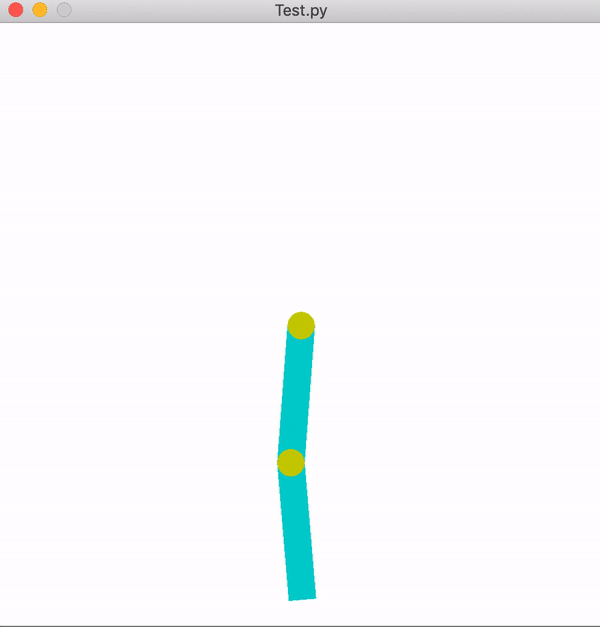

# Balancing Acrobot using PPO

The Acrobot is an underactuated system with two links and resembles a human acrobat balancing on a high-bar. Only the "elbow" joint is actuated. The "shoulder" joint has no actuation. This project solves the Acrobot Balancing in simulation using Proximal Policy Optimization.

   

    
  Trained Agent

